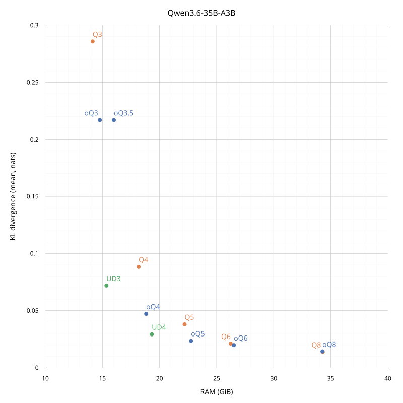
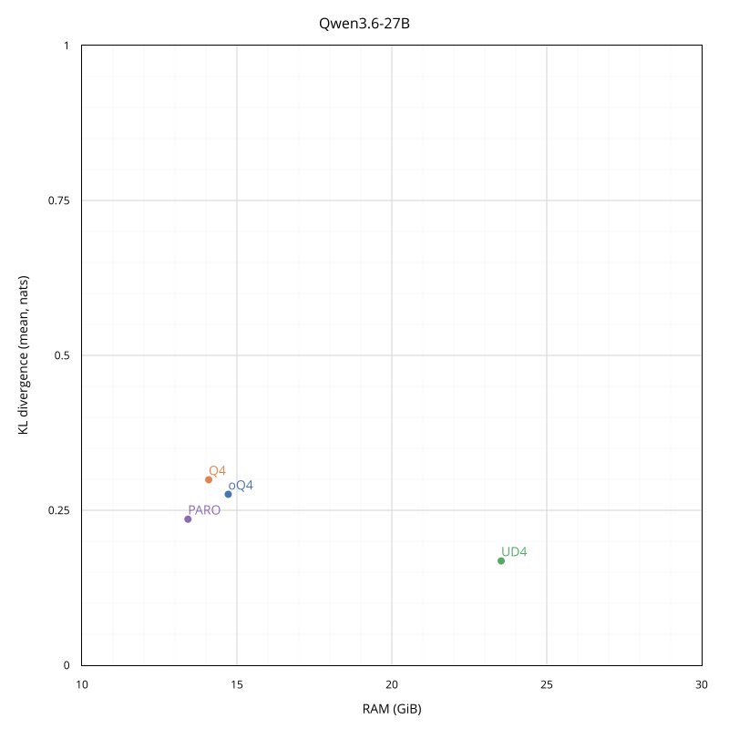

# Evaluation of various MLX quantizations

Quantization aims to reduce the precision of a language model's parameters from higher to lower bit-widths. To measure the impact, we need to compare different metrics between a reference model and its quantized versions.

## Methodology

In this evaluation, the model works in an autoregressive fashion: it receives a sequence of tokens and, in a single forward pass, predicts a probability distribution over the entire vocabulary for the next token. You can think of this as a highly advanced autocomplete: the model considers every possible next token, assigns each a likelihood, and the token with the highest probability is its best guess of what comes next. By comparing these predicted probabilities to the actual next token in the text, we can measure the model's fidelity, uncertainty, and correctness.

The prompt consists of 16 windows × 8,192 tokens = 131,072 tokens of Aes Sedai's [combined_all_micro.txt](https://huggingface.co/AesSedai/GLM-4.5-GGUF/raw/main/combined_all_micro.txt). It's *not* a "community-standard" homogeneous [WikiText-2](https://huggingface.co/datasets/Salesforce/wikitext/blob/main/wikitext-2-raw-v1/test-00000-of-00001.parquet), but rather a challenging all-in-one stress test with abrupt shifts between diverse domains. I don't attempt to cover up these difficulties, and the sudden context breaks at window boundaries are left as they are, so that every quantization is evaluated under the same conditions.

I recommend avoiding direct comparisons of absolute numbers across different models, as their architectures and training differ substantially. What really matters is the *relative* differences between quantizations of the same model within the same test suite.

## Metrics

### KLD

Kullback‑Leibler divergence (KLD) measures how much the *full* probability distribution over the vocabulary for the next token has shifted.

The unit is *nats* (units of information), because the computation uses natural logarithms. Lower KLD indicates higher fidelity, perfect value is 0.

- `KLD` – mean per-token divergence
- `KLD p95` – 95th percentile – 95% of tokens have a divergence ≤ this value, and the worst 5% exceed it
- `KLD p99` – 99th percentile – 99% of tokens have a divergence ≤ this value, and the worst 1% exceed it

### PPL

Perplexity (PPL) measures the uncertainty in the correct next token, but *not necessarily the one it chooses*. The fundamental problem is that perplexity mixes the model's intrinsic uncertainty with quantization damage, thus making PPL good for spotting anomalies, but not as a standalone fidelity metric.

The value is unitless. Lower PPL indicates higher confidence, perfect value is 1. A PPL of 10 means the model is as uncertain, *on average*, as if it were randomly choosing among 10 equally likely options.

- `PPL` – mean perplexity
- `Δ PPL` – delta in mean perplexity, occasional negative values are an artifact of quantization noise acting as a "regularization filter" and do not indicate a genuine improvement

### Acc@1

Top‑1 accuracy (Acc@1) measures how often the most probable token matches the true token.

The value is unitless. Higher Acc@1 indicates higher hard‑decision accuracy, perfect value is 1. Acc@1 of 0.5 means the top prediction matches the true next token 50% of the time.

- `Acc@1` – mean accuracy
- `Δ Acc@1` – delta in mean accuracy, occasional positive values are typically within measurement noise and do not indicate a genuine improvement

### RAM

Active memory allocated for the model's *text-only* weights, in GiB. Loading the full Vision‑Language model would add about 1 GiB of extra RAM, but the relative differences between quantizations remain the same.

### Further readings

- ["A Visual Guide to Quantization"](https://newsletter.maartengrootendorst.com/p/a-visual-guide-to-quantization)
- ["Why Maybe We're Measuring LLM Compression Wrong"](https://huggingface.co/blog/rishiraj/kld-guided-quantization)
- ["Accuracy is Not All You Need"](https://arxiv.org/abs/2407.09141)
- ["The 'Q4_K_M' Illusion: Why KL Divergence and Perplexity Are Your Only Friends in the GGUF Wild West"](https://www.banandre.com/blog/quantization-fidelity-benchmarking-kld-and-ppl-as-metrics-for-gguf-model-selection)

## Qwen3.6-35B-A3B

### Reference

- model: [Qwen/Qwen3.6-35B-A3B](https://huggingface.co/Qwen/Qwen3.6-35B-A3B)
- tool: [mlx-vlm](https://github.com/Blaizzy/mlx-vlm) v0.4.4
- multimodal: Vision-Language
- data type: bfloat16
- PPL: 5.791247
- Acc@1: 0.628037

### Q

- tool: [mlx-vlm](https://github.com/Blaizzy/mlx-vlm) v0.4.4
- mode: affine
- group size: default, omitted
- data type: bfloat16

| Quant |      KLD |  KLD p95 |   KLD p99 |        PPL |      Δ PPL |    Acc@1 |   Δ Acc@1 |   RAM | 
|-------|---------:|---------:|----------:|-----------:|-----------:|---------:|----------:|------:|
| Q2    | 3.075195 | 7.625000 | 10.250000 | 102.302048 | +96.510801 | 0.289708 | -0.338329 | 10.10 |
| Q3    | 0.285767 | 0.964844 |  2.410469 |   6.910939 |  +1.119692 | 0.598729 | -0.029308 | 14.14 |
| Q4    | 0.088287 | 0.250000 |  0.718750 |   5.934375 |  +0.143128 | 0.623565 | -0.004471 | 18.17 |
| Q5    | 0.037971 | 0.123047 |  0.292969 |   5.788420 |  -0.002827 | 0.628373 | +0.000336 | 22.20 |
| Q6    | 0.021137 | 0.100098 |  0.157227 |   5.811075 |  +0.019828 | 0.627892 | -0.000145 | 26.23 |
| Q8    | 0.013805 | 0.087402 |  0.126953 |   5.796905 |  +0.005658 | 0.628685 | +0.000649 | 34.30 |

*Q2 is off the chart

### oQ

- ["oQ: oMLX Universal Dynamic Quantization"](https://github.com/jundot/omlx/blob/main/docs/oQ_Quantization.md)
- https://huggingface.co/collections/deepsweet/qwen36-35b-a3b
- tool: [oMLX](https://github.com/jundot/omlx) v0.3.6
- sensitivity model:
  - tool: [mlx-vlm](https://github.com/Blaizzy/mlx-vlm) v0.4.4
  - quantization: Q8
  - mode: affine
  - group size: default, omitted
  - data type: bfloat16
- text-only: no
- data type: bfloat16

| Quant |      KLD |  KLD p95 |  KLD p99 |      PPL |     Δ PPL |    Acc@1 |   Δ Acc@1 |   RAM | 
|-------|---------:|---------:|---------:|---------:|----------:|---------:|----------:|------:|
| oQ2*  | 0.318237 | 1.195312 | 3.015625 | 6.807117 | +1.015871 | 0.598759 | -0.029278 | 11.40 |
| oQ3   | 0.216858 | 0.750000 | 2.031250 | 6.584811 | +0.793564 | 0.606886 | -0.021151 | 14.77 |
| oQ3.5 | 0.216858 | 0.738281 | 2.046875 | 6.517636 | +0.726389 | 0.608541 | -0.019495 | 16.00 |
| oQ4   | 0.047134 | 0.150391 | 0.419922 | 5.885319 | +0.094072 | 0.625557 | -0.002480 | 18.83 |
| oQ5   | 0.023533 | 0.103027 | 0.181641 | 5.830971 | +0.039724 | 0.627327 | -0.000710 | 22.76 |
| oQ6   | 0.019783 | 0.098145 | 0.150391 | 5.819594 | +0.028347 | 0.627487 | -0.000549 | 26.51 |
| oQ8   | 0.014273 | 0.087402 | 0.127217 | 5.768669 | -0.022578 | 0.628464 | +0.000427 | 34.27 |

*oQ2 is off the chart

oQ3 and oQ3.5 having the same KLD mean is not a typo – I've carefully checked the per‑window [logs](./Qwen3.6-35B-A3B.txt), and they are mostly slightly different in favor of oQ3.5, but the overall results are identical as a statistical coincidence.

### UD

- ["MLX Dynamic Quants"](https://unsloth.ai/docs/models/qwen3.6#mlx-dynamic-quants)
- https://huggingface.co/unsloth/Qwen3.6-35B-A3B-UD-MLX-3bit
- https://huggingface.co/unsloth/Qwen3.6-35B-A3B-UD-MLX-4bit

| Quant |      KLD |  KLD p95 |  KLD p99 |      PPL |     Δ PPL |    Acc@1 |   Δ Acc@1 |   RAM | 
|-------|---------:|---------:|---------:|---------:|----------:|---------:|----------:|------:|
| UD3   | 0.071945 | 0.225586 | 0.707031 | 5.943074 | +0.151827 | 0.623253 | -0.004784 | 15.35 |
| UD4   | 0.029251 | 0.114746 | 0.241211 | 5.785594 | -0.005653 | 0.627831 | -0.000206 | 19.32 |

### JANG

- ["Jang Adaptive N-bit Grading"](https://github.com/jjang-ai/jangq)
- https://huggingface.co/JANGQ-AI/Qwen3.6-35B-A3B-JANGTQ4

| Quant |      KLD |  KLD p95 |  KLD p99 |      PPL |     Δ PPL |    Acc@1 |   Δ Acc@1 |   RAM | 
|-------|---------:|---------:|---------:|---------:|----------:|---------:|----------:|------:|
| JTQ4  | 0.034605 | 0.092919 | 0.265739 | 5.887115 | +0.095868 | 0.625862 | -0.002175 | 17.50 |

## Qwen3.6-27B

This is a work-in-progress evaluation, I’ll add more quants over time:

>[!CAUTION]
>Qwen3.6-27B architecture finds this evaluation methodology rather challenging. Unlike the 35B-A3B MoE, the dense model struggles more on abrupt shifts between diverse domains.
>
>- Reference mean PPL is 8.804764 (expected <5).
>- Noticeable _negative_ PPL deltas suggest that the noise introduced by quantization acts as a "regularization filter", actually "helping" the model on this specific prompt.
>- The evaluation itself is correct, because when I switch to the WikiText‑2, reference mean PPL becomes 4.593750 and PPL delta +0.062500 (expected degradation). Also, on Edgar Poe's prose, mean PPL drops even lower to 1.359375.
>- Dense Gemma‑4‑31B (pre‑trained base, not instruction‑tuned) was briefly evaluated on the same prompt, and showed reference mean PPL <4.
>- PPL is good for catching anomalies, and here we have one.
>
>My intention is to keep this behavior exposed as is, because a true evaluation should not aim to please its target.

### Reference

- model: [Qwen/Qwen3.6-27B](https://huggingface.co/Qwen/Qwen3.6-27B)
- tool: [mlx-vlm](https://github.com/Blaizzy/mlx-vlm) v0.4.4
- multimodal: Vision-Language
- data type: bfloat16
- PPL: 8.804764
- Acc@1: 0.595707

### Q

- tool: [mlx-vlm](https://github.com/Blaizzy/mlx-vlm) v0.4.4
- mode: affine
- group size: default, omitted
- data type: bfloat16

| Quant |      KLD |  KLD p95 |   KLD p99 |        PPL |      Δ PPL |    Acc@1 |   Δ Acc@1 |   RAM | 
|-------|---------:|---------:|----------:|-----------:|-----------:|---------:|----------:|------:|
| Q4    | 0.299316 | 0.369141 | 10.375000 |   7.873294 |  -0.931470 | 0.600926 | +0.005219 | 14.09 |
| Q5    | 0.203751 | 0.167969 |  6.718750 |   8.143076 |  -0.661688 | 0.600881 | +0.005173 | 17.23 |
| Q6    | 0.115662 | 0.105469 |  2.156250 |   8.965280 |  +0.160517 | 0.594303 | -0.001404 | 20.36 |
| Q8    | 0.057327 | 0.082031 |  0.396484 |   8.856506 |  +0.051742 | 0.595753 | +0.000046 | 26.62 |

### oQ

- ["oQ: oMLX Universal Dynamic Quantization"](https://github.com/jundot/omlx/blob/main/docs/oQ_Quantization.md)
- https://huggingface.co/collections/deepsweet/qwen36-27b
- tool: [oMLX](https://github.com/jundot/omlx) v0.3.8
- sensitivity model:
  - tool: [mlx-vlm](https://github.com/Blaizzy/mlx-vlm) v0.4.4
  - quantization: Q8
  - mode: affine
  - group size: default, omitted
  - data type: bfloat16
- text-only: no
- data type: bfloat16

| Quant |      KLD |  KLD p95 |  KLD p99 |      PPL |     Δ PPL |    Acc@1 |   Δ Acc@1 |   RAM | 
|-------|---------:|---------:|---------:|---------:|----------:|---------:|----------:|------:|
| oQ4   | 0.275848 | 0.304688 | 9.500000 | 8.048206 | -0.756558 | 0.600156 | +0.004448 | 14.72 |
| oQ5   | 0.200607 | 0.166992 | 6.218750 | 8.048206 | -0.756558 | 0.601323 | +0.005616 | 17.69 |
| oQ6   | 0.118469 | 0.104980 | 2.265625 | 8.991584 | +0.186821 | 0.594059 | -0.001648 | 20.65 |

### UD

- ["MLX Dynamic Quants"](https://unsloth.ai/docs/models/qwen3.6#mlx-dynamic-quants)
- https://huggingface.co/unsloth/Qwen3.6-27B-UD-MLX-4bit

| Quant |      KLD |  KLD p95 |  KLD p99 |      PPL |     Δ PPL |    Acc@1 |   Δ Acc@1 |   RAM | 
|-------|---------:|---------:|---------:|---------:|----------:|---------:|----------:|------:|
| UD4   | 0.168304 | 0.159180 | 4.477188 | 8.255171 | -0.549592 | 0.599179 | +0.003472 | 23.53 |

### PARO

- ["ParoQuant: Pairwise Rotation Quantization for Efficient Reasoning LLM Inference"](https://github.com/z-lab/paroquant)
- https://huggingface.co/z-lab/Qwen3.6-27B-PARO

| Quant |      KLD |  KLD p95 |  KLD p99 |      PPL |     Δ PPL |    Acc@1 |   Δ Acc@1 |   RAM | 
|-------|---------:|---------:|---------:|---------:|----------:|---------:|----------:|------:|
| PARO  | 0.235654 | 0.246749 | 7.366954 | 8.461260 | -0.343504 | 0.596165 | +0.000458 | 13.42 |
